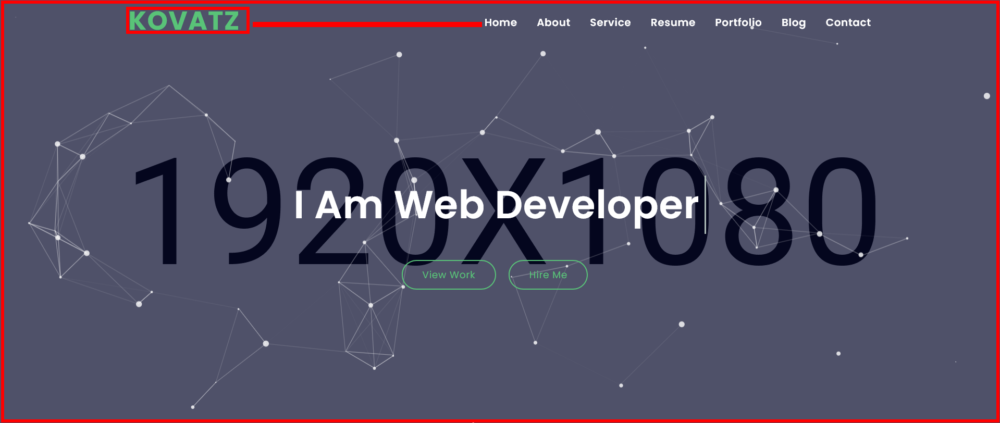
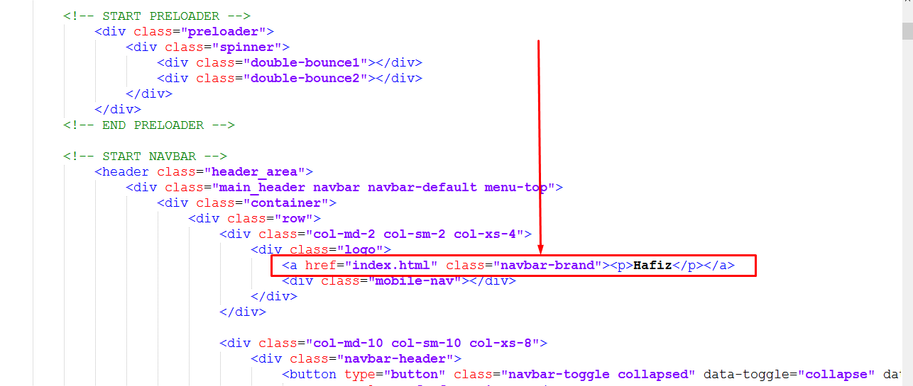
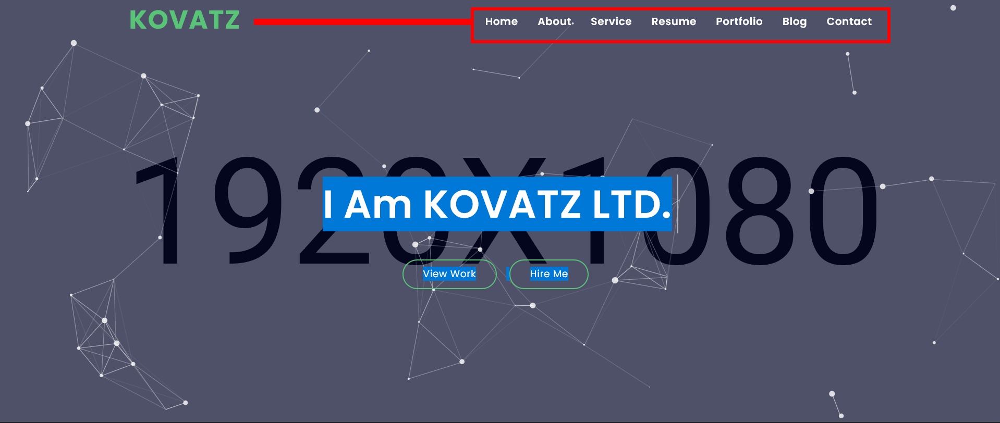
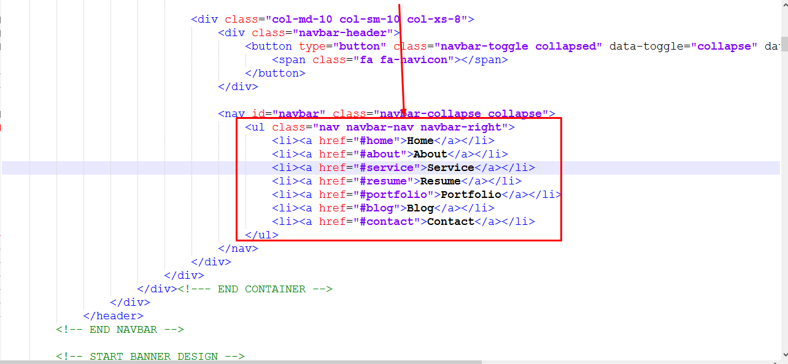
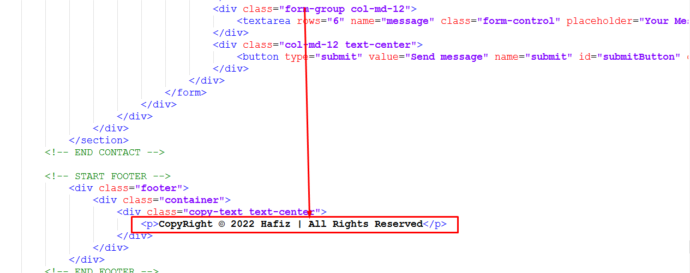
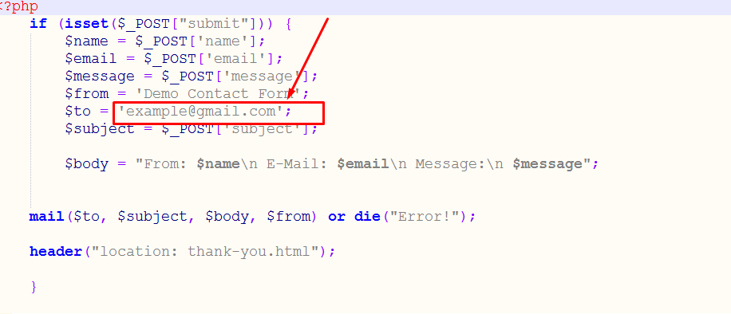

[KOVATZ](index.html)
-------------------

*   [Template Installation](#installation)
*   [Pages](#pages)
*   [Fonts](#fonts)
*   [Source File (CSS)](#sourcecss)
*   [Source File (JS)](#sourcejs)
*   [Customization](#customization)
*   [Thanks](#thanks)
* 

### KOVATZ Personal Portfolio HTML Template

Thank you for purchasing my theme. If you have any questions that are beyond the scope of this help file, please feel free to open a new ticket at our

Template Installation
---------------------

### FTP Upload:

1.  Open up your FTP manager and connect to your hosting
2.  Browse to required directory (Normally public\_html)
3.  Upload the files inside portfolio folder.

Pages

1.  home Home
2.  about About
3.  service Service
4.  resume Resume
5.  portfolio Portfolio
6.  blog Blog
7.  contact Contact

--------------------------------------------------------------------------------------------------------------------------------------

Fonts
-----
~~~~
@import url('https://fonts.googleapis.com/css?family=Poppins:300i,400,400i,500,600,700,800&display=swap');
~~~~
Source File (CSS)
-----------------

~~~~
							<!-- All css files are included here. -->
							<link rel="stylesheet" href="css/plugins/bootstrap.min.css">
							<link rel="stylesheet" href="css/plugins/animate.css">							
							<link rel="stylesheet" href="css/plugins/animate.min.css">
							<link rel="stylesheet" href="css/plugins/animated-headline.css">
							<link rel="stylesheet" href="css/font-awesome.min.css">
							<link rel="stylesheet" href="css/lightbox.min.css">
							<link rel="stylesheet" href="css/plugins/normalize.css">
							<link rel="stylesheet" href="css/plugins/owl.carousel.min.css">
							<link rel="stylesheet" href="css/plugins/owl.theme.css">						
							<link rel="stylesheet" href="css/plugins/owl.theme.default.min.css">
							<link rel="stylesheet" href="css/plugins.css">
							<link rel="stylesheet" href="css/responsive.css">	
							<link rel="stylesheet" href="css/style.css">							
~~~~

Source File (JS)
----------------
~~~~
							<!-- ALL JS FILES HERE -->
								
							
														
							
									
														
							
							
													
							
														
														
							
											
							
												
														
							
							
~~~~

Customization
-------------

#### How to Change Header Logo

 

#### How to Change Nav Menu

 

#### How to Change Copyright Text

 

#### How to Change Contact Form Email

Open Mail.php File

Thanks
------

##### Once again thank you for purchasing one of our Templates

###### Best Regards

